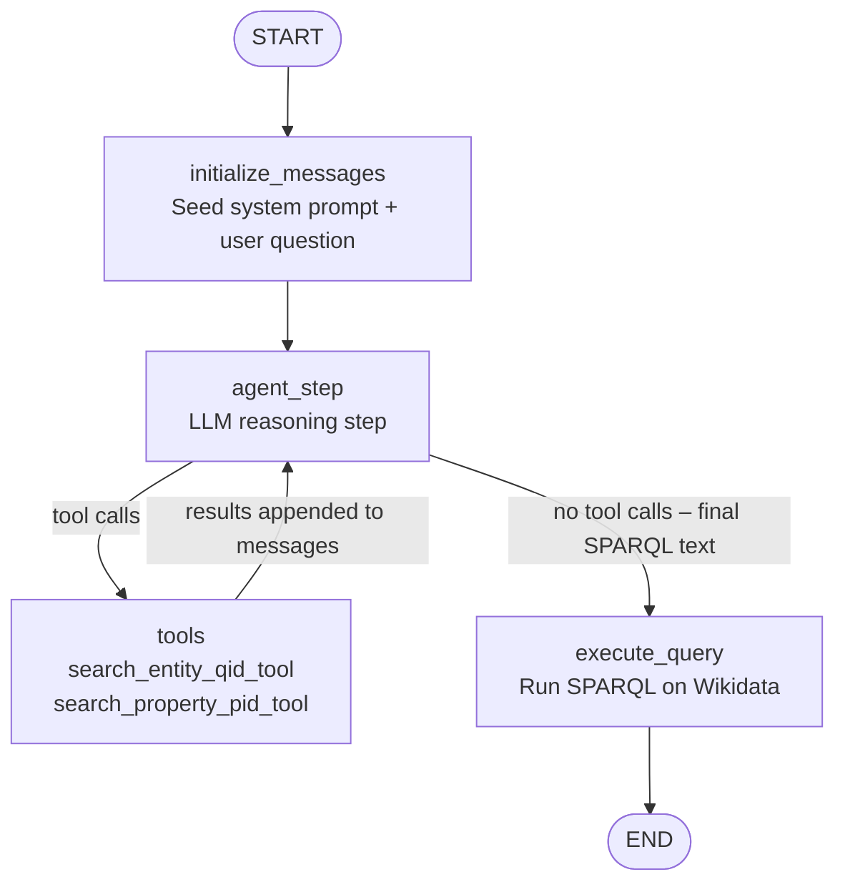

# Agent4Wikidata
An agent that allows users to query WikiData with natural languages via a CLI.

## Usage
This is a Docker-First application.
To setup the environment (primarily use local LLM):
```powershell
cd "<project_dir>"
git clone https://github.com/YSChen0609/Agent4Wikidata.git
docker build -t ask-wikidata:latest .

# Optional: Ollama in Docker — then pull a model (e.g. qwen2.5-coder:7b)
docker volume create ollama
docker run -d -v ollama:/root/.ollama -p 11434:11434 --name ollama ollama/ollama
docker exec -it ollama ollama pull qwen2.5-coder:7b
```

Put LLM settings in `ask_wikidata/.env` (example for Ollama from a container):
```env
LLM_PROVIDER=ollama
LLM_MODEL=qwen2.5-coder:7b
OLLAMA_BASE_URL=http://host.docker.internal:11434
```

The main CLI commands:
```powershell
docker run --rm ask-wikidata:latest --help
docker run --rm -it --env-file ".\ask_wikidata\.env" ask-wikidata:latest nl-query "What is the capital of France?"
docker run --rm ask-wikidata:latest version
```

For further troubleshooting, please refer to:
- `docs/OLLAMA_DOCKER_FIRST.md`
- `docs/DOCKER_WORKFLOW.md`

## Architecture
The NL → SPARQL pipeline is a LangGraph state machine (`ask_wikidata/sparql_query_graph.py`) running a **ReAct-like loop**: the agent reasons about the question, optionally calls Wikidata lookup tools to resolve names to IDs, then generates the final SPARQL query once it has enough context.

### Lookup tools

The agent has two tools it can call during the loop (`ask_wikidata/wikidata_lookup_tools.py`):

| Tool | Description | Example |
|---|---|---|
| `search_entity_qid_tool` | Resolves an entity name to its Wikidata **QID** | `France` → `Q142` |
| `search_property_pid_tool` | Resolves a property name to its Wikidata **PID** | `capital` → `P36` |

Both tools call the Wikidata `wbsearchentities` API and return `NOT_FOUND` if no match exists.

### Flow



State keys: `query_nl`, `messages`, `query_sparql`, `query_results`.
